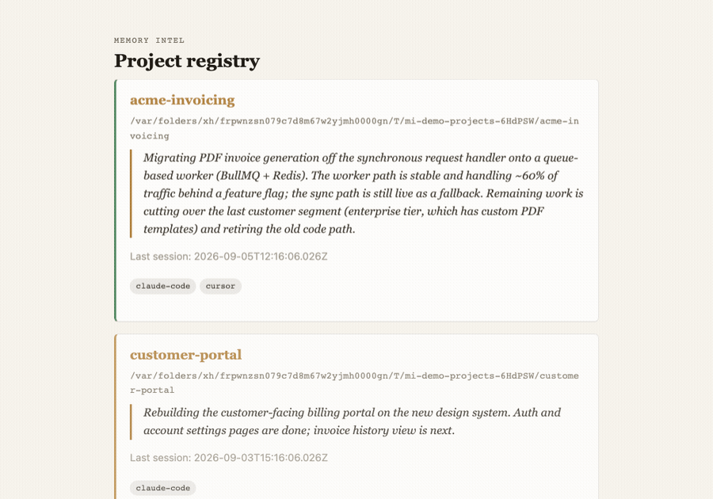
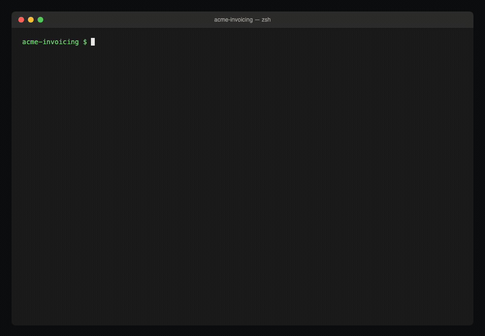

# Memory Intel

[](https://github.com/adeeshsharma/memoryintel/actions/workflows/ci.yml)
[](https://www.npmjs.com/package/memoryintel)
[](LICENSE)

Persistent, cross-session project memory for AI coding agents. Set it up once per project; after
that, agents automatically load and update project understanding — architecture, decisions,
progress, a running "mental model" — across new chats, new sessions, and even across tools
(Claude Code, Cursor, Codex, Gemini CLI).

This repository is itself running Memory Intel on itself — see `.memoryintel/` for the tool's own
current state, decisions, and open todo items. Any agent with the skill below active will read it
automatically.



*The local dashboard (`memoryintel dashboard enable`) — a read-only view of every initialized
project on the machine. Demo data shown above; captured against the real running server, not
mocked up. [Watch the full tour (mp4)](assets/dashboard-demo.mp4) for automation status, session
activity, and the event timeline too.*

## Quick Start

```bash
npx skills add adeeshsharma/memoryintel --skill memoryintel   # teaches an agent the shape of it
npm install -g memoryintel                                      # the CLI those instructions call
```

Then, in any project, ask an agent to "set up persistent memory here" once. From then on, `load`/
`update` fire automatically via Claude Code's `SessionStart`/`Stop` hooks (see "Point Claude Code
at the plugin" below) — nothing else to remember. See `.memoryintel/instructions.md` in a given
project for its own specific guidance once initialized.

## Install

**The CLI** is on the npm registry:

```bash
npm install -g memoryintel
# or run it without installing:
npx memoryintel status
```

**The Claude Code plugin** — this is what actually wires up automatic `SessionStart`/`Stop`
hooks, not just agent-readable instructions. This repo is its own marketplace
(`.claude-plugin/marketplace.json`), so no separate hosting or git clone is needed:

```bash
claude plugin marketplace add adeeshsharma/memoryintel
claude plugin install memoryintel@memoryintel
```

That's a one-time install — restart Claude Code and the hooks are active for every session from
then on, in every project. See "Skill vs. plugin" below if it's not obvious why this is a plugin
and not just a skill.

**Just the skill, no automation** — if you want the agent-facing instructions (what `memoryintel
init`/`load`/`update` are and when to use them) without the automatic hooks, install it standalone:

```bash
npx skills add adeeshsharma/memoryintel --skill memoryintel
```

<details>
<summary>Developing/testing this plugin locally, without the marketplace</summary>

```bash
claude --plugin-dir "$(npm root -g)/memoryintel"   # or any local checkout
```

`--plugin-dir` is Claude Code's own documented flag for loading a plugin from a specific
directory for one session, bypassing marketplaces entirely (see
[Create plugins](https://code.claude.com/docs/en/plugins)). Needs to be passed every launch; a
shell alias avoids retyping it:

```bash
alias claude-mi='claude --plugin-dir "$(npm root -g)/memoryintel"'
```

</details>

### Skill vs. plugin

A **skill** is just instructions loaded into an agent's context — it teaches an agent *what to
do*, and the agent decides on its own judgment *whether* to act on it. A **plugin** is a bundle
that can include a skill *and* hooks — commands Claude Code itself runs automatically at fixed
lifecycle moments (`SessionStart`, `Stop`), no agent judgment involved. Memory Intel's plugin
bundles both: the skill (`skills/memoryintel/SKILL.md`) plus `hooks/hooks.json`, which runs
`memoryintel load` at the start of every session and `memoryintel check-stop` at the end of every
one — the latter can even block finishing until memory's been updated. The standalone skill
install above gives an agent the knowledge; only the plugin gives you the automation that doesn't
depend on the agent noticing anything.

### If you don't want to touch Claude Code's plugin system at all

The CLI works standalone, with no plugin/skill/hook involved — useful for scripting, for other
tools, or just to try it out. This is exactly what a `SessionStart`/`Stop` hook runs for you
automatically when a plugin is active — shown here run by hand so you can see what actually
happens under the hood:

```bash
memoryintel init      # once per project — scaffolds .memoryintel/, installs pointer files
                       # for tools without native hooks (Cursor, Codex, Gemini CLI, opencode)
memoryintel load       # print resolved context to stdout
memoryintel update plan.toon   # apply an update-plan
```



*`init` → `load` → draft a real update-plan → `update` → `load` again, now auto-carrying the
domain the update just touched. Every command above actually ran; nothing is a typed-out
transcript. [Watch the full walkthrough (mp4)](assets/cli-walkthrough.mp4) for the update-plan and
the auto-carry-domain payoff.*

`memoryintel init` never touches a project's own `.claude/settings.json` — Claude Code automation
comes entirely from the plugin's own `hooks/hooks.json` in this repo, active once the plugin
itself is active. From then on, agents load and update project memory on their own, per that
project's own `.memoryintel/instructions.md`.

If a shared local dashboard is running (a read-only view of every initialized project on this
machine), turn it off any time with `memoryintel dashboard disable` — or back on with
`memoryintel dashboard enable`.

## Prerequisites

Node.js ≥18 — actually verified as the real floor (CI runs the full suite on Node 18), not an
assumed default.

## How it works


`.memoryintel/` is a structured, git-committed set of markdown/JSON files — the single source of
truth both directions in the diagram above read from and write to. At session start, `load()`
prints the always-loaded files plus whichever technical/business/research domain the most recent
`update()` actually touched (an explicit `--domain` still overrides). The agent works, then drafts
an update-plan and calls `update()`, which validates it, writes atomically under a per-file lock,
and logs the change — never a changelog, always a maintained understanding of the project as it
currently is.

Full design docs live in `docs/superpowers/specs/`; a diagram-heavy architecture reference lives
in `docs/architecture/memory-intel-architecture.html`. See `.memoryintel/context/decisions.md` in
this very repository for the specific design decisions behind the mechanism above, with rationale.

### What `memoryintel init` actually creates

Exactly this, and nothing else — every file below is real output from a fresh `memoryintel init`,
not a hand-typed example:

```text
.memoryintel/
├── instructions.md              # what an agent reads every session — the mechanism, in full
├── memory-config.json           # compression ceiling overrides, generated-file hashes (for `doctor`)
├── memory-index.json            # lastUpdated + one-line summary per file, keyed by path
├── memory-events.jsonl          # append-only log: every load/update/compression, ever
│
├── context/                     # always loaded in full — no --domain needed
│   ├── currentMentalModel.md    # whole-file replace only; the one narrative summary, not a log
│   ├── activeContext.md         # what session-to-session work is focused on right now
│   ├── projectBrief.md          # what the project is, for someone who's never seen it
│   ├── objectives.md            # goals the project is actually working toward
│   ├── decisions.md             # append-only decision log, with rationale
│   ├── progress.md              # what's done, what's in flight
│   └── learnings.md             # things worth not re-learning the hard way
│
├── technical/                   # a --domain: architecture, stack, patterns
│   ├── architecture.md
│   ├── techContext.md
│   ├── patterns.md
│   ├── integrations.md
│   └── infrastructure.md
│
├── business/                    # a --domain: product, roadmap, stakeholders
│   ├── productContext.md
│   ├── roadmap.md
│   ├── stakeholders.md
│   └── marketContext.md
│
└── research/                    # a --domain: findings, open questions
    ├── findings.md
    ├── references.md
    └── hypotheses.md

AGENTS.md                        # pointer file (or .cursor/rules/memoryintel.mdc, GEMINI.md) —
                                  # tells tools with no native hook where instructions.md lives
```

`context/` loads on every session automatically; `technical/`, `business/`, and `research/` are
domains — `load()` pulls in whichever one the most recent `update()` touched, or you can ask for
one explicitly (`memoryintel load --domain technical`). Every file starts as an empty, headed
scaffold; there's no separate "add a new memory type" step; you just write to any of the 19 files
above via an update-plan, same as any other.

## Existing projects (not greenfield)

`memoryintel init` scaffolds empty files — fine for a brand-new project, wasteful for one that
already has real history. Two commands help, and most existing projects want both, in order:

```bash
memoryintel scan     # read-only: stack + top-level layout, nothing more
memoryintel import   # write: pulls every real doc in the repo into the matching section
```

Neither command tries to reverse-engineer architecture from code — no import-graph analysis, no
git-history mining, no keyword extraction. That's a real judgment task, and this project already
has a mechanism for judgment: the agent's own accumulated `update` calls as it actually works in
the repo, exactly like it already works for a greenfield project. These two commands exist only
to stop session one from flailing, not to front-load understanding they can't honestly derive.

**`scan`** never writes anything — it prints detected stack (`package.json`/`pyproject.toml`/
`go.mod`/`Cargo.toml`: dependencies, scripts, entry points) and a one-level-deep directory
listing. That's it. Enough to answer "how do I even run this" without reading the tree cold.

**`import`** walks the whole repo for real documentation — any `.md`/`.html` file, anywhere, not
just a fixed list of known filenames like `memory-bank/`'s convention. An HTML file only counts
if it's an actual document (real prose, not a bundled SPA shell — index.html with a mount div and
a script tag doesn't count). Each document's content is copied verbatim into a `.memoryintel/`
section chosen by matching keywords in its filename/title (`architecture.md` → `technical/
architecture.md`, `product-notes.md` → `business/productContext.md`, anything unrecognized still
lands in `context/projectBrief.md` rather than being silently dropped). Purely mechanical — no
summarizing, splitting, or interpreting, and memoryintel's own pointer-file boilerplate (in
`AGENTS.md`/`GEMINI.md`) is filtered out so it's never mistaken for real project content. Safe to
re-run; already-imported content is skipped, not duplicated.

## Benchmarks: with vs. without

Measured on a real second project ([distilled-docs](https://github.com/adeeshsharma/distilled-docs),
an 8-phase, single-day build), not a synthetic one. Methodology: real file sizes from that
project's actual `.memoryintel/` state, tokens estimated at ~4 chars/token (a standard, slightly
conservative approximation — not measured API telemetry, since neither path logs real token
counts from the model provider).

**Per-session context bootstrap:**

| | Chars | Tokens (est.) |
|---|---|---|
| `memoryintel load` (curated: mental model + active context + technical domain) | 9,223 | ~2,300 |
| No memory, conservative (skim one architecture doc) | 6,126 | ~1,500 |
| No memory, realistic (doc + git log + a handful of source files) | ~28,000 | ~7,000 |
| No memory, worst case (re-derive from the full source tree, 49 files) | 113,652 | ~28,400 |

That's **67–92% fewer tokens per session bootstrap**, depending on how much of the codebase an
agent would otherwise need to re-read to reach equivalent situational awareness — and that range
brackets the same order of magnitude as published numbers from purpose-built memory systems for
chat agents ([Mem0](https://arxiv.org/pdf/2504.19413): ~90% vs. full context; Letta/MemGPT-class
systems: 85–93%), despite solving a different problem (durable project state, not conversation
history).

**Why the gap widens over time, not just per-call:** `.memoryintel/` content is self-compressing,
capped at ~12,000 chars per file by default — load cost stays roughly flat as a project grows. The
no-memory alternative doesn't; it scales with total codebase size. A project one day old and one
a year old cost about the same to bootstrap with Memory Intel. Without it, the older project costs
more, every single session.

**Not just tokens:** `context/decisions.md` and `context/learnings.md` hold things a memory-less
agent would otherwise silently redo or get wrong twice — a real example from that same build: a
subtle bundler bug (a literal-string dynamic `import()` statically resolved by esbuild instead of
treated as a runtime URL) got fixed once and recorded, not re-debugged on the next session that
touched that code path.

These numbers are reproducible for your own project: every `memoryintel load` call logs a
`session-load` event (domain, files, character/line counts) to `memory-events.jsonl`, visible in
the dashboard's "Session activity" section or queryable directly from the event log.

## Development

Working on this repo itself, rather than just using the published package:

```bash
git clone https://github.com/adeeshsharma/memoryintel.git
cd memoryintel
npm install
npm run build                # compiles dist/, regenerates skills/memoryintel/SKILL.md from src/skill.ts
npm link                     # makes `memoryintel` resolve to this exact checkout instead of the published one
npm test                     # 300 tests, vitest
npm run build:skill:check    # fails if skills/memoryintel/SKILL.md has drifted from src/skill.ts
```

CI (`.github/workflows/ci.yml`) runs the full suite on Ubuntu, Windows, and macOS on every
push/PR to `master`, and is required via branch protection.

## Releasing

Automated with [release-please](https://github.com/googleapis/release-please) and npm [Trusted
Publishing](https://docs.npmjs.com/trusted-publishers/) — see [RELEASING.md](RELEASING.md).
`CHANGELOG.md` is generated automatically starting with the first automated release.

## Contributing

Issues and pull requests are welcome — see [CONTRIBUTING.md](CONTRIBUTING.md).

## License

[MIT](LICENSE)
